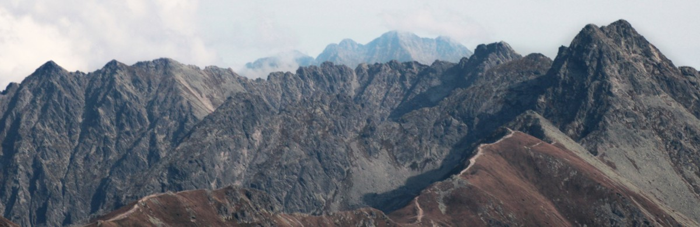

# Hi!
I'm student of Wrocław University of Science and Technology.

 • [Personal webpage](goorkamateusz.github.io)
 • [Pinterest](https://pl.pinterest.com/goorkamateusz/_saved/)
 • [Instagram](https://www.instagram.com/goorkamateusz/)
 • [Facebook](https://www.facebook.com/goorkamateusz)
 • [LinkedIn](https://www.linkedin.com/in/goorkamateusz/)
 •

___
**My interests:**
🕹 `GameDev`
🌐 `Distributed systems`
🗃 `Backend`
🛠 `Software architecture`
🧪 `Unit tests`
🤖 `Life automation`
⛰ `Mountains`
🎚 `Sound engineering`
📷 `Photography & graphics`

___
**Favorite technologies:**
`C#` (.NET, Unity, Xamarin),
`Python`,
`C++`,
`C`,
`PHP`,
`JavaScript` (jQuery),
`HTML`,
`CSS`,
`LaTeX`

_Orla Perć, Tatra Mountains, Poland_
